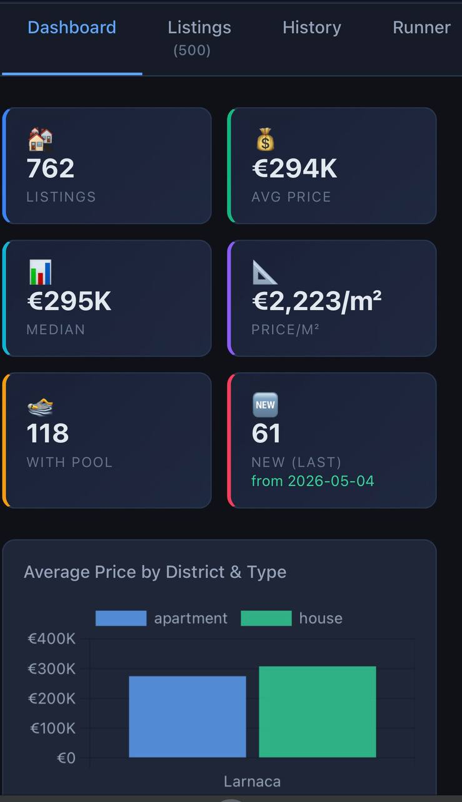
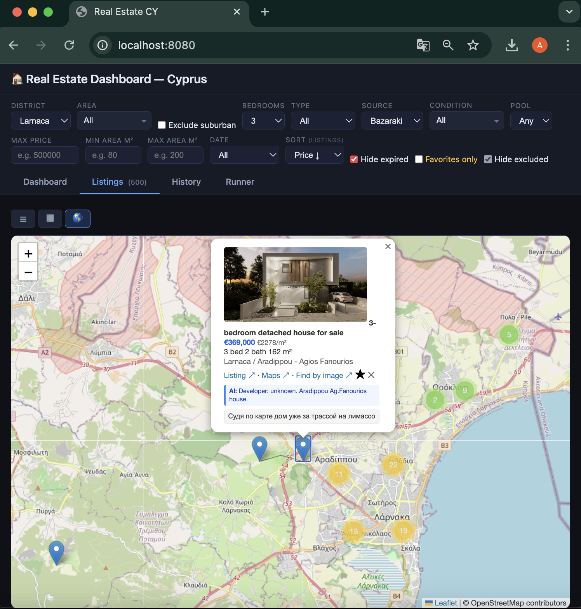
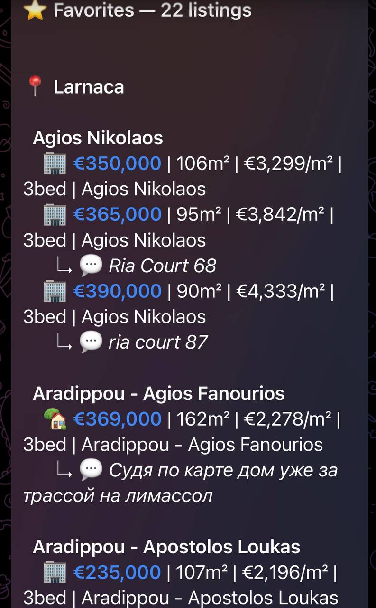

# Real Estate Aggregator — Cyprus

End-to-end data pipeline that scrapes property listings from three Cyprus real estate platforms, normalises and enriches the data, detects deals, and serves an interactive analytics dashboard — all built with Python's standard library and minimal dependencies.

## Screenshots

### Dashboard — KPI & Charts
| Dashboard | Cards | Map | Telegram |                                                                                                                                      
  |---|---|---|---|                                                                                                                                                             
  |  |  |  |  |

---

## Architecture

```
┌──────────────────────────────────────────────────────────────────────┐
│                         DATA COLLECTION                              │
├──────────────────┬──────────────────────┬────────────────────────────┤
│  Bazaraki        │  dom.com.cy          │  Cyprus Sotheby's Realty   │
│  Playwright      │  Chrome CDP          │  Plain HTTP (urllib)       │
│  Cloudflare      │  SafeLine WAF        │  No protection             │
│  bypass          │  bypass              │                            │
├──────────────────┴──────────────────────┴────────────────────────────┤
│               3 x SQLite databases (26-29 columns each)              │
└──────────────────────────────────────────────────────────────────────┘
                                │
                ┌───────────────┼───────────────┐
                ▼               ▼               ▼
        ┌──────────────┐ ┌───────────┐ ┌──────────────┐
        │ Backfill     │ │ Check     │ │ Developer    │
        │ coords/imgs  │ │ expired   │ │ scraper      │
        └──────────────┘ └───────────┘ └──────────────┘
                │               │               │
                └───────────────┼───────────────┘
                                ▼
                    ┌───────────────────────┐
                    │   user_data.db        │
                    │   favorites, comments │
                    │   excluded, linked    │
                    │   ai_reviews          │
                    └───────────────────────┘
                                │
                ┌───────────────┼───────────────┐
                ▼               ▼               ▼
        ┌──────────────┐ ┌───────────┐ ┌──────────────┐
        │  Dashboard   │ │ Streamlit │ │  Telegram    │
        │  server.py   │ │ dashboard │ │  alerts      │
        │  :8080       │ │ :8501     │ │              │
        └──────────────┘ └───────────┘ └──────────────┘
```

## Features

### Scrapers (3 sources)

Each scraper follows a modular pattern: `scraper.py` + `config.py` + `db.py` + `notify.py`.

- **Bazaraki** — Cyprus' largest classifieds. Protected by Cloudflare; uses Playwright with stealth plugin and visible browser mode. Extracts 23+ fields per listing.
- **dom.com.cy** — Developer-focused platform. Protected by SafeLine WAF; uses real Chrome via DevTools Protocol (port 9222) instead of Playwright's bundled Chromium. Extracts additional fields: `developer_name`, `project_name`, `indoor_area_sqm`.
- **Sotheby's Cyprus** — Luxury segment. No anti-bot protection; uses stdlib `urllib` + regex parsing. Zero external dependencies.

All scrapers support:
- District filtering (Limassol, Larnaca, Paphos)
- Bedroom count filtering
- Fast mode (card-only, no detail pages) and full mode
- Configurable page limits
- Idempotent upserts (re-scraping updates existing records)

### Dashboard (`server.py`)

A single-file, zero-dependency web server built on Python's `http.server`:

- **KPI cards**: total listings, average/median price, EUR/m², pool count, new listings
- **Charts**: price by district & type, price histogram, listings by district (pie), bedroom distribution, condition breakdown, price by area (top 25)
- **Listings table/grid/map** with 15+ sortable columns
- **Interactive map** (Leaflet.js + MarkerCluster) with popups showing listing details, Google Maps links, reverse image search
- **Filters**: district, area, bedrooms, type, source, condition, pool, price range, area range, date, hide expired, favorites only, hide excluded
- **User actions**: star/favorite, exclude, comment, link/match
- **Script runner**: launch scrapers, backfill jobs, export to Telegram — all from the UI with real-time log streaming
- **Cross-source matching**: scoring algorithm finds the same property across sources (district +30, bedrooms +25, price +20, area +15, sub-district +10), auto-enriches linked listings with coordinates, developer info, images

### Data Enrichment Pipelines

- `backfill_coords.py` — geocodes listings missing GPS coordinates
- `backfill_images.py` — fetches thumbnail images from listing detail pages
- `check_expired.py` — marks removed/expired listings (HEAD checks for dom.cy, Playwright for Cloudflare-protected Bazaraki)
- `scrape_developers.py` — extracts developer/project associations from dom.com.cy
- `export_larnaca.py` — filters and sends deal alerts to Telegram

### Deal Detection

Notifications trigger when a listing's EUR/m² falls below the **25th percentile** for its market segment (district + bedrooms + condition). Segments are computed per scraping session.

---

## Project Structure

```
.
├── server.py                 # Main dashboard server (zero dependencies)
├── dashboard.py              # Streamlit analytics dashboard (alternative UI)
├── check_expired.py          # Expiration checker
├── check_coords.py           # Coordinate extraction validator
│
├── bazaraki/                 # Bazaraki.com scraper module
│   ├── scraper.py            #   Playwright-based scraper
│   ├── config.py             #   URLs, selectors, limits
│   ├── db.py                 #   SQLite schema & CRUD
│   ├── notify.py             #   Telegram notifications
│   └── .env.example          #   Environment variables template
│
├── dom_cy/                   # dom.com.cy scraper module
│   ├── scraper.py            #   Chrome CDP-based scraper
│   ├── config.py             #   URLs, selectors, limits
│   ├── db.py                 #   SQLite schema & CRUD
│   ├── notify.py             #   Telegram notifications
│   └── .env.example          #   Environment variables template
│
├── sothebys/                 # Cyprus Sotheby's scraper module
│   ├── scraper.py            #   Plain HTTP scraper (no browser)
│   ├── config.py             #   URLs, selectors, limits
│   ├── db.py                 #   SQLite schema & CRUD
│   └── __init__.py
│
│
└── screenshots/              # Screenshots for README
```

## Tech Stack

| Layer | Technology |
|---|---|
| Scraping | Playwright (sync API), Chrome DevTools Protocol, urllib (stdlib) |
| Anti-bot bypass | Playwright stealth plugin, real Chrome CDP session |
| Storage | SQLite3 (4 databases, 26-29 columns per listing) |
| Web server | Python stdlib `http.server` (zero dependencies) |
| Frontend | Vanilla JS, Chart.js, Leaflet.js + MarkerCluster |
| Alternative UI | Streamlit + Plotly |
| Notifications | Telegram Bot API |
| Analytics | Pandas (notebooks) |

## Setup

### Prerequisites

- Python 3.11+
- Playwright (`pip install playwright && playwright install chromium`)
- Google Chrome (for dom.cy CDP scraper)

### Installation

```bash
git clone https://github.com/yourusername/real-estate-cyprus.git
cd real-estate-cyprus

python3 -m venv .venv
source .venv/bin/activate
pip install playwright python-dotenv
playwright install chromium
```

### Configuration

Copy the environment templates and fill in your Telegram bot credentials:

```bash
cp bazaraki/.env.example bazaraki/.env
cp dom_cy/.env.example dom_cy/.env
# Edit .env files with your TELEGRAM_BOT_TOKEN and TELEGRAM_CHAT_ID
```

### Running

**Dashboard** (recommended — single entry point for everything):
```bash
python3 server.py --port 8080
# Open http://localhost:8080
```

**Individual scrapers:**
```bash
# Bazaraki (needs visible browser for Cloudflare)
python3 bazaraki/scraper.py 5 --districts Larnaca,Limassol --bedrooms 2,3

# dom.com.cy (needs Chrome running or will launch one)
python3 dom_cy/scraper.py 5 --districts Larnaca

# Sotheby's (plain HTTP, no browser needed)
python3 sothebys/scraper.py 5 --districts Paphos
```

**Data enrichment:**
```bash
python3 backfill_coords.py --source sothebys
python3 backfill_images.py --source dom_cy --batch 50
python3 check_expired.py --source bazaraki
```

## Database Schema (per source)

Each source database stores listings with 26-29 columns:

| Column | Type | Description |
|---|---|---|
| `id` | TEXT (PK) | Listing ID from source |
| `url` | TEXT | Original listing URL |
| `title` | TEXT | Listing title |
| `price_eur` | REAL | Price in EUR |
| `price_per_sqm` | REAL | Computed EUR/m² |
| `property_type` | TEXT | apartment / house |
| `district` | TEXT | Limassol / Larnaca / Paphos |
| `area` | TEXT | Sub-district / neighbourhood |
| `bedrooms` | INTEGER | Number of bedrooms |
| `bathrooms` | INTEGER | Number of bathrooms |
| `area_sqm` | REAL | Total area in m² |
| `indoor_area_sqm` | REAL | Indoor (covered) area |
| `condition` | TEXT | new / resale / under construction |
| `construction_year` | TEXT | Year built |
| `furnishing` | TEXT | Furnished / unfurnished |
| `has_pool` | INTEGER | Boolean: private pool |
| `latitude` | REAL | GPS latitude |
| `longitude` | REAL | GPS longitude |
| `image_url` | TEXT | Thumbnail URL |
| `developer_name` | TEXT | Developer company |
| `project_name` | TEXT | Development project |
| `posted_date` | TEXT | Date listed |
| `scraped_at` | TEXT | Timestamp of scraping |
| `is_expired` | INTEGER | Marked as removed |

## Cross-Source Matching Algorithm

When a user clicks the link button on a listing, the system searches other sources for the same property:

```
Score (0-100):
  Same district          +30
  Same bedrooms          +25
  Price within ±10%      +20 (scaled linearly)
  Area within ±10%       +15 (scaled linearly)
  Same sub-district      +10

Minimum threshold: 40 (must match district + at least one other field)
```

On confirmation, the system auto-enriches both listings: dom.cy gets GPS coordinates from Sotheby's, Sotheby's gets developer/project info from dom.cy, missing images are filled in.

---

## License

MIT
